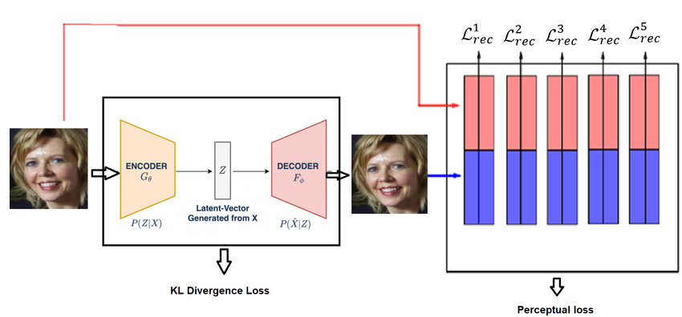
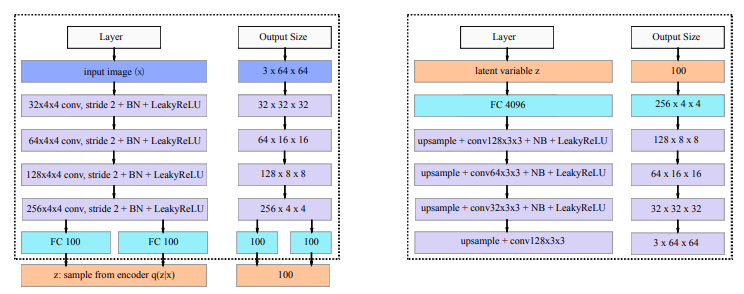
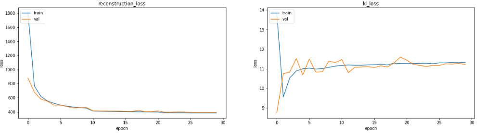
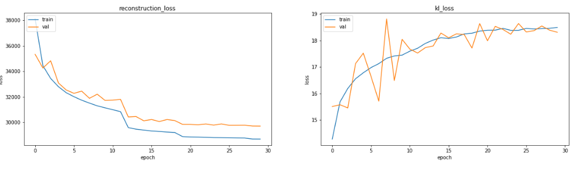
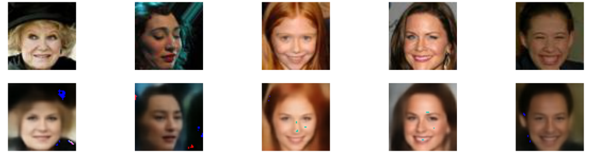
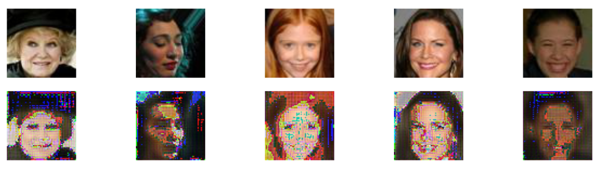
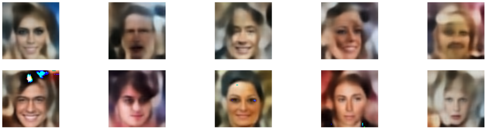
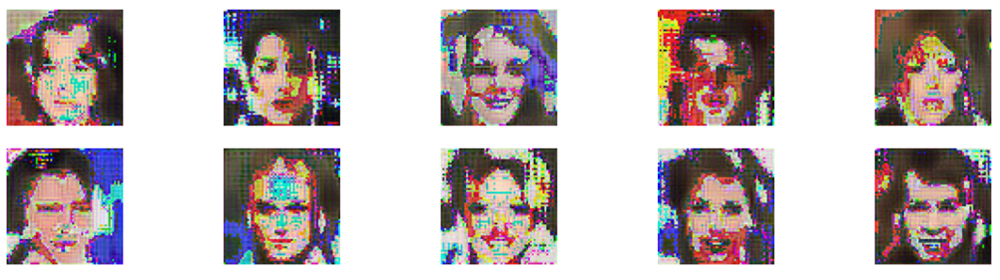

# Celebrity Image Reconstruction using Deep Convolutional Variational AutoEncoder with Perceptual Loss (CVAE-PL)

In this study, two variants of Variational AutoEncoders (VAE) are investigated for their effectiveness in producing and reconstructing images using two different kinds of loss functions: feature perceptual loss (CVAE_PL) and pixel-by-pixel loss (PVAE) . This work is a modularized version of this kaggle Notebook with the name [[Celeb Faces] : VAE trained with Perceptual Loss](https://www.kaggle.com/code/arnrob/celeb-faces-vae-trained-with-perceptual-loss).

# VAE Architecture with Perceptual Loss

# Encoder Decoder Architecture

# Loss with PVAE

# Loss with CVAE-PL

# Reconstruction with PVAE

# Reconstruction with CVAE_PL

# New Face Generation with PVAE

# New Face Generation with CVAE_PL

### Dataset
For the investigations, the publicly accessible CelebFaces Attributes (CelebA) dataset is used.  For easy access, the dataset has been incorporated into the codebase. The CelebA dataset is described in further detail [here](http://mmlab.ie.cuhk.edu.hk/projects/CelebA.html).

### How to Use
1. Make a local copy of the repository.
2. Launch and operate the Jupyter Notebook or Google Colab notebook [Perceptual_Loss_in_VAE.ipynb](Perceptual_Loss_in_VAE.ipynb) in your preferred environment.
3. Use the notebook's instructions to experiment with the VAE models and evaluate how well they work.

## ⭐ Give a Star!

If you found this project useful or interesting, please consider giving it a star on GitHub! Your support is greatly appreciated and helps to motivate me to keep improving the project. Here’s how you can give a star:

1. **Sign in to GitHub**: Make sure you are logged into your GitHub account. If you don't have an account, please sign up.

2. **Navigate to the Repository**: Go to the repository page.

3. **Click the Star Button**: At the top right of the repository page, click the "Star" button. That’s it!

 
